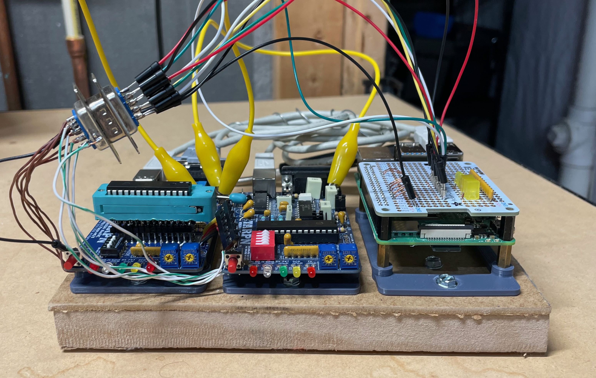

# N9600A-Validate
Scripts for automatic validation of N9600A firmware. The purpose of this project is to reduce the human time required in validating new firmware versions for the N9600A NinoTNC. Using two slightly-modified TNCs, a Raspberry Pi, and a USB sound card, most validation tasks can performed without oversight. 

## Software Requirements
* Python3
* pyserial module
* local copy of repository found at https://github.com/ninocarrillo/modem-test-audio (big, 1GB+!)

## Hardware Requirements
* Two NinoTNCs... I'm using an A4r1 and an A4r2 that I had laying around
* Raspberry Pi with 40-pin header
* Pi-Hat prototyping board... I used [this one from Adafruit](https://www.adafruit.com/product/2310)
* USB sound card... mine is a [Soundblaster Play! 3](https://www.amazon.com/Creative-Labs-70SB173000000-Sound-Blaster/dp/B06XBZ38ZJ/ref=sr_1_1?crid=2YAW4WUG3B18K&keywords=soundblaster+play+3&qid=1705937031&sprefix=soundblaster+play+3%2Caps%2C57&sr=8-1)
* Insulated copper wire for connections... I used solid core from old ethernet cables
* TRRS plug for the sound card, wired to a DE-9 male connector to the TNC
* Optional LEDs and resistors for flashing lights on the Pi-Hat
* Two alligator clip leads to connect TXA and RXA between the TNCs
* Some sort of mounting base and appropriate M2.5 or M3 hardware

