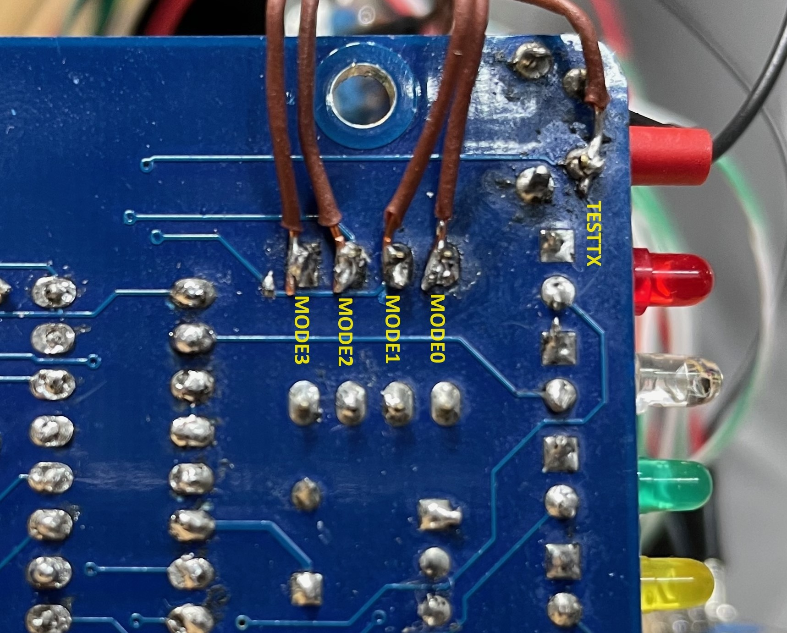

# N9600A-Validate
Scripts for automatic validation of N9600A firmware. The purpose of this project is to reduce the human time required in validating new firmware versions for the N9600A NinoTNC. Using two slightly-modified TNCs, a Raspberry Pi, and a USB sound card, most validation tasks can performed without oversight. 

## Software Requirements
* Python3
* pyserial module
* local copy of repository found at https://github.com/ninocarrillo/modem-test-audio (big, 1GB+!)

## Hardware Requirements
* Two NinoTNCs... I'm using an A4r1 and an A4r2 that I had laying around
* Raspberry Pi with 40-pin header
* Pi-Hat prototyping board... I used [this one from Adafruit](https://www.adafruit.com/product/2310)
* USB sound card... mine is a [Soundblaster Play! 3](https://www.amazon.com/Creative-Labs-70SB173000000-Sound-Blaster/dp/B06XBZ38ZJ/ref=sr_1_1?crid=2YAW4WUG3B18K&keywords=soundblaster+play+3&qid=1705937031&sprefix=soundblaster+play+3%2Caps%2C57&sr=8-1)
* Insulated copper wire for connections... I used solid core from old ethernet cables
* TRRS plug for the sound card, wired to a DE-9 male connector to the TNC
* Optional LEDs and resistors for flashing lights on the Pi-Hat
* Two alligator clip leads to connect TXA and RXA between the TNCs
* Some sort of mounting base and appropriate M2.5 or M3 hardware
* Soldering iron and basic tools

## TNC Switch Connections
All four MODE switch signal lines from both TNCs are connected to individual Raspberry Pi GPIO pins via the Pi-Hat. I refer to the TNCs as "TEST" device (the TNC with firmware under validation) and "STANDARD" device (the TNC with an already-validated firmware version). The MODE switch pins closest to the edge of the PCB are the signal pins. When the MODE switches are all in the off position, these pins are only connected to the respective sampling pins on the dsPIC. The Raspberry Pi can drive these signal lines with its GPIO pins, allowing scripted MODE changes on each TNC. The Raspberry Pi GPIO lines are mapped to the TNC switches as follows:
### TEST Device Dignals to Raspberry Pi GPIO:
   * MODE3 <--> GPIO 17
   * MODE2 <--> GPIO 18
   * MODE1 <--> GPIO 27
   * MODE0 <--> GPIO 22
   * TESTTX <--> GPIO 23\
     Image of under side of TEST TNC. Connections on STANDARD TNC similar, but omit TESTTX:
    
### STANDARD Device Signals to Raspberry Pi GPIO:
  * MODE3 <--> GPIO 24
  * MODE2 <--> GPIO 25
  * MODE1 <--> GPIO 5
  * MODE0 <--> GPIO 6  

Don't forget to make a common ground connection between the two TNCs and the Pi. Optionally, you can use some sort of connector to make the wire bundle detachable from the Pi-Hat. I used DE-9 male and female connectors for this purpose, Since there are 9 signals in this scheme, I soldered the ground wires to both of the DE-9 metal shields.

### Audio Connection to TEST TNC DE-9:
I use a USB sound card to provide an audio interface to the Raspberry Pi. Mine uses a Tip-Ring-Ring-Sleeve (TRRS) connector for audio signals in and out. I think the TRRS pinout is fairly standard for these types of devices. 
  * TIP (Left Audio Channel from DAC) <--> TNC pin 5 (RXA)
  * RING (Right Audio Channel from DAC) <--> No Connection
  * RING (Ground) <--> TNC pin 6 (Ground)
  * SLEEVE (Microphone) <--> TNC pin 1 (TXA)  

### Alligator Clip Leads
The TNC audio test loops are connected to provide a loopback on the TEST TNC and allow the STANDARD TNC to decode packets sent by the TEST TNC. I use two alligator clip leads to make these connections.
  * TEST TNC TXA <--> TEST TNC RXA
  * TEST TNC TXA <--> STANDARD TNC RXA  
    
  
